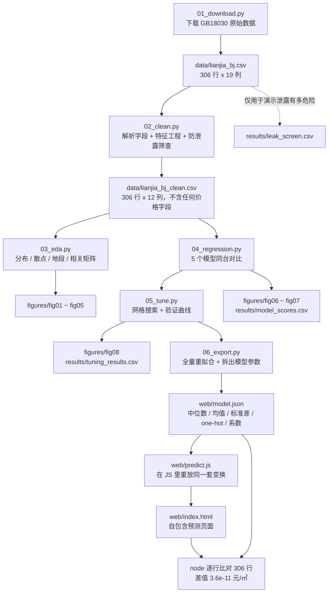

# 北京二手房单价预测

《Python机器学习教程》第 7 章「综合练习」的完整实现 —— **用真实链家二手房数据，
预测北京二手房的单价（元/㎡）**，算法全部取自教程本身：线性回归、岭回归、
多项式回归、K 近邻回归，配合交叉验证与网格搜索调参。

---

## 一、练习出处

`4-Python机器学习教程.pdf` 第 50 页，第 7 章「综合练习」全文只有一句话：

> 应用上述算法思想对股票、房价（新房、二手房）进行预测，或者根据一些个人信息
> 对要购买的物品进行推荐。

题目**没有给数据、没有指定算法、没有评分标准**。所以本项目的做法是：

1. 自己找一份可下载、可复现的真实数据（链家北京二手房 306 条挂牌记录）；
2. 只挑教程里讲过的回归算法（§6.1）和交叉验证调参（§2.6.5），不引入教程之外的模型；
3. 把「数据采集 → 清洗 → 探索 → 建模 → 调参」拆成 5 个可独立运行的脚本。

**预测目标限定为「单价（元/㎡）」，不预测总价。** 这个选择本身就是本练习最有价值的
部分，理由见第四节。

---

## 二、怎么跑

环境用 `uv` 管理，Python 3.11 + scikit-learn 1.9.1。

```bash
cd D:/learnn/yingyong/ans/god
uv sync                                # 按 uv.lock 还原依赖

uv run python src/01_download.py       # 下载数据（首次运行需要联网）
uv run python src/02_clean.py          # 清洗 + 特征工程 + 防泄露筛查
uv run python src/03_eda.py            # 探索性分析，出 5 张图
uv run python src/04_regression.py     # 5 个模型对比，出 2 张图
uv run python src/05_tune.py           # 网格搜索调参，出 1 张图
uv run python src/06_export.py         # 生成预测网页 web/index.html 并用 node 校验
```

跑完最后一步，**双击 `web/index.html`** 就能用（不需要起服务器、不需要联网）。

六个脚本都是**幂等**的，随便重复跑。数据下载到 `data/lianjia_bj.csv` 之后就会跳过，
要强制重下加 `--force`。



---

## 三、数据

**来源**：GitHub 仓库 [`yinghaopeng/Housing-Price-with-the-COVID-19-base-on-Beijing`]
(https://github.com/yinghaopeng/Housing-Price-with-the-COVID-19-base-on-Beijing)

原始数据采集自**链家网北京二手房频道**，共 **306 条**挂牌记录、19 个字段
（标题 / 标签 / 小区 / 地段 / 价格(万) / 单价 / 户型 / 面积 / 朝向 / 装修 / 楼层 /
年份 / 形式 / 关注人数 / 分布日期 / 交通 / VR / 房本 / 看房时期）。

> **⚠️ 使用声明**：该数据集由第三方从链家网公开页面采集，仓库中标注**仅供学习使用**。
> 本项目仅用于完成课程练习，不作任何商业用途，也不对数据时效性、
> 完整性或准确性作任何担保。数据为挂牌价而非成交价，且采集时间未知，
> 与当前市场情况无关。

两个容易踩的坑，`01_download.py` 里都处理了：

| 坑 | 现象 | 处理 |
|---|---|---|
| **编码是 GB18030，不是 UTF-8** | 直接按 UTF-8 读全是乱码 | 下载后 `.decode('gb18030')` 再存成 UTF-8，编码问题只在 01 里出现一次 |
| **GitHub 个人仓库链接会失效** | 单靠一个 URL 早晚下不到 | `SOURCES` 列表放主/备两个地址，逐个重试 3 次并退避，全失败时打印手动下载指引 |

其它两个数据陷阱在 `common.py` 里有注释说明：

- **字符串列带填充空格**（`' 精装 '`、`' 世纪星城 '`）。不 `.strip()` 的话
  OneHotEncoder 会把 `' 精装 '` 和 `'精装'` 当成两个类别，类别数无故翻倍。
  另外 **pandas 3 起字符串列的 dtype 是 `str` 而不再是 `object`**，
  写 `if df[c].dtype == object` 会静默跳过所有字符串列，strip 完全失效。
- **`价格(万)` 整列是纯数字**，pandas 直接推断成整数类型，没有 `.str` 访问器可用。
  统一先 `.astype(str)` 再正则提取。

### 清洗后的建模表

`data/lianjia_bj_clean.csv`，306 行 × 12 列：

| 类型 | 字段 |
|---|---|
| 目标 | `单价`（元/㎡） |
| 数值特征 | `面积` `房间数` `厅数` `总层数` `建成年` `关注人数` `近地铁` `南北通透` |
| 类别特征 | `地段`(143 个取值) `装修`(4) `形式`(3) |

| 指标 | 值 |
|---|---|
| 单价 最小值 / 中位数 / 均值 / 最大值 | 14,588 / **64,634** / 70,546 / 179,955 元/㎡ |
| 单价 标准差 | 30,919 元/㎡ |
| 面积 最小值 / 中位数 / 最大值 | 44.3 / 91.5 / 329.6 ㎡ |
| 字段解析率 | 面积 306/306、单价 306/306、总层数 306/306、建成年 305/306 |
| 剩余缺失 | 建成年 1 个、形式 5 个 → 交给 Pipeline 里的 `SimpleImputer`，不手工填 |

**异常值没有删。** 按 IQR 规则有 6/306 行落在 `[Q1-1.5IQR, Q3+1.5IQR]` 之外，
但它们不是错误值，而是核心城区与远郊的真实价差 —— 地段对单价的方差解释率高达
0.897（见下节），价格跨度大**本来就是这批数据的主要信息**。按 IQR 硬删会把最贵的
核心区样本切掉，等于把模型唯一有效的预测依据删了。`02_clean.py` 会把这个取舍打印出来。

---

## 四、先说结论：为什么「单价」比「总价」难得多

这一节的数字全部来自 `03_eda.py` 的实际输出，不是估算。

### 4.1 单价几乎由地段决定，而面积几乎不含信息

| 关系 | 数值 | 含义 |
|---|---|---|
| **地段对单价的方差解释率 η²** | **0.897** | 单价近 90% 的波动可以由「在哪个地段」解释 |
| `corr(面积, 单价)` | **-0.086** | 面积和单价基本无关 |
| `corr(建成年, 单价)`（整体） | -0.286 | 越新反而越便宜？见 4.2 |
| `corr(关注人数, 单价)` | +0.013 | 无关 |

**面积为什么无关？** 因为目标是「每平米的价格」，面积在定义上就被除掉了。
总价 = 单价 × 面积，所以面积对**总价**当然有效（`fig02` 右图 r = +0.627），
但对单价无效（左图 r = -0.086）。这正是「预测单价」这个目标选择的全部代价 ——
也是最值得写进报告的一个发现。

### 4.2 一个辛普森悖论

`fig05` 画了两张图：

- **全部房源合并看**：`corr(建成年, 单价) = -0.286`，房子越新越便宜？
- **扣掉本地段均值后再看**：`corr = +0.281`，同地段内越新越贵。

真相是核心城区（老房子多）整体单价高、远郊（新房子多）整体单价低，
「地段」这个混杂变量把真实关系整个盖住了 —— 这就是**辛普森悖论**。

### 4.3 两个由此推出的建模决策

**决策一：地段必须用全部 143 个取值做 one-hot，不能只留高频的。**

143 个地段里有 **123 个只有 3 套及以下**房源。如果按「取出现次数 Top-N 的地段、
其余归入『其他』」来做，会把 2/3 的样本塞进一个桶里，信号全丢 ——
实测 CV R² 从 0.39 直接塌到 0.02。所以：

- 保留全部 143 个取值，配 `OneHotEncoder(handle_unknown='ignore')`。
  `handle_unknown='ignore'` 是**必须的**：地段碎到这种程度，每个交叉验证折里
  都必然出现训练集没见过的新地段，用默认的 `'error'` 会直接抛异常。

**决策二：多项式特征只能加在数值列那一支，不能包住 one-hot。**

教程 §6.1 的写法是 `make_pipeline(PolynomialFeatures(2), Ridge())`，多项式加在
**整个**设计矩阵上。本数据 143 个地段 one-hot 之后已经有 150 多列，再做 2 次多项式
是**上万维、306 个样本**，必然过拟合。实测 `Ridge+Poly2` 的 CV R² 只有 **+0.008**，
而且折间标准差高达 **0.468**（折与折之间天差地别，说明根本没学到稳定规律）。

正确做法见 `common.py` 里的 `DegreeOnNumeric`：**只对数值列做多项式展开，
one-hot 列原样保留。**

---

## 五、防数据泄露（本项目最要紧的正确性问题）

### 5.1 泄露是怎么发生的

原始数据里有一列 `价格(万)`。而：

```
单价 = 价格(万) × 10000 / 面积
```

也就是说 **`价格(万)` 是目标变量的另一种写法**。用它当特征，模型等于直接把答案抄进去。

`04_regression.py` 里专门做了一次**反面教材演示**：

| 特征 | Ridge 的 5 折 CV R² |
|---|---|
| 正常特征 | **+0.385** |
| 加上 `价格(万)` | **+0.881** |

高了 50 个百分点。如果报告里出现 0.88 这个数字，那一定是错的。

### 5.2 为什么「看相关系数」拦不住它

这是本项目最容易出错、也最值得记录的一点：

```
corr(价格(万), 单价) = 0.664
```

**只有 0.664。** 如果按常见的做法「相关系数绝对值超过 0.95 就判为泄露」，
这一列会**安然无恙地留在特征表里** —— 相关系数低是因为单价 = 价格/面积，
两者是倒数关系而非线性关系，Pearson 相关系数天然测不出这种强依赖。

### 5.3 本项目实际用的判据

`common.py` 里的 `guard_no_leakage()` 用**三道关**：

1. **列名黑名单**：任何列名匹配 `价格|总价|单价|首付|万元|_万$` 一律拦截；
2. **显式排除列表 `DROP_ALWAYS`**：`单价`(目标) / `价格(万)` / `标题` / `标签` /
   `小区` / `VR` / `看房时期` / `分布日期`；
3. **单特征交叉验证筛查**（真正的判据）：把每个特征**单独**拿去预测目标，
   CV R² 超过 **0.35** 判为泄露。

实测结果（`results/leak_screen.csv`）：

| 特征 | 单特征 CV R² | 判定 |
|---|---|---|
| `价格_万` | **0.4207** | **泄露** |
| `建成年` | 0.0508 | 正常 |
| 其余 7 个数值特征 | -0.036 ~ -0.003 | 正常 |

**阈值为什么是 0.35 而不是 0.5**：`价格_万` 的单特征 R² 是 **0.421**，
用 0.5 当阈值会把它**漏过去**；而所有合法特征的 R² 都在 ±0.05 以内，
0.35 这条线把两者分得很干净。

其余被排除的列及理由：

| 列 | 排除理由 |
|---|---|
| `标题` | 108/306 条标题里直接写着小区名，等于把「小区」这个近乎唯一的标识符拼了回来 |
| `标签` | 306 行只有 1 个取值，零方差 |
| `小区` | 282 个唯一值 / 306 行，比样本还碎，只能记住不能泛化（**只在 EDA 里展示，不作特征**） |
| `分布日期` / `看房时期` / `VR` | 与房价无因果关系，且容易引入时间泄露 |

另外，本项目**没有**引入任何按 `地段`/`小区` 分组的均价类特征，也没有从 `单价`
反推的任何量 —— 那些都属于 target encoding 泄露。`02_clean.py` 落了一条断言：
建模表里不允许出现 `DROP_ALWAYS` 中的任何一列。

---

## 六、实测结果

### 6.1 五个模型同台（`04_regression.py`）

`train_test_split(test_size=0.2, random_state=42)` → 244 训练 / 62 留出。
5 折交叉验证用 `KFold(n_splits=5, shuffle=True, random_state=42)`。

| 模型 | 5折 CV R² | CV 标准差 | 留出集 R² | 留出集 RMSE |
|---|---|---|---|---|
| 均值基线 `DummyRegressor(strategy='mean')` | -0.028 | 0.030 | -0.011 | 30,391 元/㎡ |
| 线性回归 `LinearRegression` | +0.352 | 0.040 | +0.305 | 25,193 元/㎡ |
| **岭回归 `Ridge(alpha=1)`** | **+0.385** | 0.068 | **+0.390** | **23,609 元/㎡** |
| K近邻回归 `KNN(k=5)` | +0.055 | 0.119 | -0.022 | 30,560 元/㎡ |
| 岭回归+多项式 `Ridge+Poly2` | +0.008 | 0.468 | +0.072 | 29,122 元/㎡ |

**怎么读这张表：**

- **均值基线 R² = -0.028（负数）**。负数完全正常 —— 每一折的「平均值」是拿另外
  4 折算出来的，换到当前这折上未必准，所以比直接猜还差一点。这个数就是
  「什么都不学」的及格线：**任何模型低于它都算白做**。留出集 RMSE 30,391 元/㎡
  差不多就是单价标准差 30,919，也印证了「什么都没学到」。
- **线性模型赢**。`Ridge(alpha=1)` 的 R² 比基线高 0.41，说明地段确实带进了真实信息。
- **KNN 和多项式双双失败**，而且不是「差一点」，是**接近零**。
  这两个「失败」是预期内的，也是本练习最有教学价值的结果 —— 在真实的高维稀疏
  特征上，**算法不是越复杂越好**。这比教程里用二维人造数据讲 §2.4 过拟合更有说服力。

### 6.2 调参（`05_tune.py`）

| 搜索对象 | 搜索范围 | 最优参数 | 调参前 CV R² | 调参后 CV R² | 净提升 |
|---|---|---|---|---|---|
| `Ridge.alpha` | 0.001 ~ 1000，25 组对数等分 | **alpha = 0.316** | +0.385 | **+0.434** | **+0.048** |
| `Ridge` 多项式次数 + alpha | degree ∈ {1,2,3} × alpha 9 组 | **degree = 1**（即不加多项式） | +0.385 | +0.434 | +0.048 |
| `KNN.n_neighbors` | {1,2,3,5,8,12,16,20,25,30,40,60} | **k = 40** | +0.055 | +0.081 | +0.026 |

**最终模型**：`Ridge(alpha=0.316)` —— 留出集 R² = **+0.427**，RMSE = **22,873 元/㎡**。

**三点解读：**

1. **调参有用，但幅度有限**（+0.048）。提升是真的，但天花板由数据本身决定，
   不是由参数决定 —— 把所有超参数搜遍也到不了 0.6，因为数据里没有那些信息。
2. **多项式次数那一栏，网格自己选了最简单的一档（degree=1）**。把次数和 alpha
   放进同一个网格一起搜，`GridSearchCV` 主动放弃了多项式。这是「奥卡姆剃刀」
   在真实数据上的一次自动演示。
3. **验证曲线（`fig08`）把教程 §2.4 的过拟合/欠拟合画出来了**：
   - 左图 Ridge：alpha 从 0.001 到 0.316，**训练得分一直趴在 0.9 以上，验证得分
     只有 0.36~0.43** —— 两条线之间那道巨大的缝就是过拟合。alpha 调大后训练得分
     往下掉、验证得分先升后降，在 0.316 处取到最高的 0.434；再往右两条线一起塌到 0，
     那就是欠拟合。阴影带是折间标准差，越宽说明模型越依赖「碰巧分到哪一折」。
   - 右图 KNN：**k=1 时训练得分是满分 1.000** —— 每个点最近的邻居就是它自己，
     纯背答案。k 增大后训练得分下降、验证得分上升，两条线靠拢，这才是学到了规律。
     但 KNN 调到头也只有 0.081，原因见下。

### 6.3 为什么 KNN 在调参后依然很差

KNN 靠「距离」找邻居，而本项目有 **143 个地段 one-hot** 之后，特征空间又高维又稀疏：
任意两个样本在这 143 维上的距离几乎一样远，**「邻居」失去了意义**。
这是典型的**维度灾难**，把 k 从 1 调到 60 也治不好 —— 它不是参数问题，是特征表示问题。

反观线性模型，它给每个地段学一个独立的系数，在这个场景下天然比距离度量合适。

---

## 七、图表

全部 8 张图在 `figures/`，中文标签，浅色底。

| 文件 | 内容 | 想说明什么 |
|---|---|---|
| `fig01_target_dist.png` | 单价分布直方图 + 取对数后 | 原始偏度 +1.08，取 log10 后 -0.03，右偏长尾 |
| `fig02_area_vs_price.png` | 面积 vs 单价 / 面积 vs 总价 | **r = -0.086 对比 r = +0.627**，本练习的核心问题 |
| `fig03_district_price.png` | 各地段单价中位数（前 15，含全市中位数参考线） | 地段效应 η² = 0.897 |
| `fig04_corr_heatmap.png` | 相关矩阵（发散配色，灰中点对齐 0） | 含 `价格_万` 一行：与单价只有 0.66 |
| `fig05_confound.png` | 辛普森悖论：整体 vs 扣掉地段均值 | -0.286 与 +0.281 的符号反转 |
| `fig06_model_compare.png` | 5 个模型的 CV R² / 留出集 R² 并排条形图 | 含泄露反面教材的红色标注 |
| `fig07_pred_vs_actual.png` | 最优模型预测值 vs 真实值 | 散点被压在中间，模型不敢预测极端价 |
| `fig08_validation_curve.png` | Ridge alpha 与 KNN k 的验证曲线 | 过拟合 / 欠拟合的三段走势 |

---

## 八、预测界面（`src/06_export.py` → `web/index.html`）

把模型做成一个能直接用的网页：左边填房源条件，右边立刻出预测单价，并告诉这个价钱
在 306 条挂牌记录里处于什么位置。**单个 HTML 文件，双击就开，离线可用，不依赖任何后端。**

### 8.1 怎么让网页算出和 Python 一模一样的数

网页要显示预测值，但浏览器里没有 scikit-learn。两条路：起一个 Flask 服务让网页调
Python，或者**把模型参数搬到 JS 里**。这里选后者 —— 交付物是一个文件，不用装环境、
不用起进程、不会因为端口占用打不开。

之所以能做到**精确**而不是近似，是因为最终模型是**线性**的：
`Ridge` 的预测就是 `截距 + Σ 系数 × 特征`。所以只要把管线每一步的参数原样搬到 JS：

| Python 里的一步 | 导出的参数 | JS 里怎么重放 |
|---|---|---|
| `SimpleImputer(strategy="median")` | `impute_median` | 缺失值取训练集中位数 |
| `StandardScaler()` | `scaler_mean` / `scaler_scale` | `(v - mean) / scale` |
| `SimpleImputer(most_frequent)` | `cat_fill` | 类别缺失取众数 |
| `OneHotEncoder(handle_unknown="ignore")` | `categories` | 命中第 i 个类别则第 i 位为 1，否则全 0 |
| `Ridge(alpha)` | `coef` / `intercept` | 线性组合 |

`web/predict.js` 就是这套重放逻辑，**网页和校验脚本共用同一份实现** —— 不会各写一份
然后慢慢漂移。

### 8.2 怎么确认两边算的是同一件事

导出的参数**不做任何四舍五入**。这一点踩过坑：最初为了「让 JSON 好看点」把
`scaler` 留 6 位小数、系数留 10 位有效数字，结果 one-hot 的系数动辄上万，
这点截断误差乘上去能到 `1e-2` 元/㎡ 量级 —— `06_export.py` 里的 node 校验第一轮
就是这么把问题抓出来的。现在一律按 `float64` 原样导出，`json.dumps` 输出的 repr
本身就是能精确往返的最短表示。

`06_export.py` 的最后一步会调 `node`，用 `web/predict.js` 把 **306 行数据整表跑一遍**，
和 Python 的预测值逐行比对，差值超过 `1e-6` 元/㎡ 就 `assert` 失败、拒绝发布：

```
JS 与 Python 逐行比对 306 行：最大差值 3.638e-11 元/㎡（相对 7.4e-16）  ✓ 一致
```

`3.6e-11` 已经贴着 `float64` 的精度极限（相对误差 `7.4e-16`，约 3 个 ULP），
而网页把价格显示到整数位，所以这点差别连显示的最后一位都影响不到。
比较用的期望值也必须是未取整的 —— 若这里写 `round(..., 6)`，光期望值自己就带了
`5e-7` 的误差，会把真正的差异淹没。

> 没装 node 时这一步会打印 `[跳过]` 并继续，但会明确提示「网页逻辑未经验证」。

### 8.3 页面上有什么

- **预测结果**：大字单价值 + 房源摘要（`望京 · 91.5㎡ · 2室1厅 · 2005年建`）。
- **两个对照**：全市中位数与该地段中位数，各带一个涨跌百分比。用来看「这个价钱是贵还是便宜」。
- **误差如实标注**：RMSE 22,873 元/㎡ 直接写在页头，并说明「这是一万多元量级的估计，
  不是精确报价」。
- **三张图**：
  1. 单价分布 —— 全市 306 套与该地段房源各占一条泳道，橙色竖线是预测，虚线是全市中位数；
  2. 面积 vs 单价 —— 拟合线几乎水平，坐实 `r = -0.086`；
  3. 建成年 vs 单价 —— 全市虚线 `r = -0.286`（越新越便宜）与本地段实线 `r = +0.635`
     （越新越贵）画在同一张图上，是 §4.2 辛普森悖论的直观版。

几个刻意的取舍：

- **第一张图没有数值纵轴**。纵向位置只是把点摊开的抖动，不编码任何数值；
  一开始这里画了条「元/㎡」纵轴，纵坐标却是随机数 —— 等于让人能从上往下读出一个
  根本不存在的价格。现在用两条泳道标签代替纵轴，说明每一排到底是什么。
- **趋势线在 Python 侧算好再导出**（`area_trend` / `year_trend`），网页只负责画。
  这样网页上的 `r` 值和 README 里 `fig02`/`fig05` 的数字必然一致，不会各算各的。
  只有「该地段的趋势线」是网页现算的 —— 它随下拉框变化，没法预先导出，
  但它只在有 ≥2 套房源的地段才画。
- **配色和字号跟着系统深色模式切换**。SVG 元素全靠 CSS class 上色，
  主题切换时不需要重画，只换 CSS 变量。
- **`web/index.html` 是生成物**，改编模板 `web/template.html` 或 `predict.js` 之后
  要重跑 `06_export.py`。它仍进版本库，是为了让仓库 clone 下来就能直接用。

---

## 九、教程 API → 现代 scikit-learn 对应表

教程写作时间较早，其中不少 API 已经被移除或改名。本项目统一用现代 API：

| 教程里的写法 | 现状 | 本项目改用 |
|---|---|---|
| `sklearn.grid_search.GridSearchCV` | 已移除 | `sklearn.model_selection.GridSearchCV` |
| `sklearn.cross_validation.train_test_split` | 已移除 | `sklearn.model_selection.train_test_split` |
| `sklearn.cross_validation.cross_val_score` | 已移除 | `sklearn.model_selection.cross_val_score` |
| `sklearn.cross_validation.KFold` | 已移除 | `sklearn.model_selection.KFold` |
| `sklearn.datasets.samples_generator.make_blobs` | 已移除 | `sklearn.datasets.make_blobs` |
| `sklearn.preprocessing.Imputer` | 已移除 | `sklearn.impute.SimpleImputer` |
| `LinearRegression(normalize=True)` | 参数已删除 | 标准化交给 Pipeline 里的 `StandardScaler` |
| `OneHotEncoder(sparse=False)` | 参数已改名 | `OneHotEncoder(sparse_output=False)` |
| `KFold(n_splits=5)`（不打乱） | 仍可用但不推荐 | `KFold(..., shuffle=True, random_state=42)` |
| `make_pipeline(('name', est), ...)` | **1.9 起不再接受 `(名字, 估计器)` 元组** | 用 `Pipeline([('name', est), ...])` |

最后一行是本项目实际踩到的坑：`make_pipeline` 会把整个 `('imp', SimpleImputer(...))`
元组当成一个「估计器」，名字取类型名，于是 step 变成
`('tuple-1', ('imp', SimpleImputer(...)))` 这种废东西，`ColumnTransformer`
接着报 `All estimators should implement fit and transform`。
**要自定义 step 名字，只能用 `Pipeline` + 显式列表。** 详见 `common.py` 的注释。

---

## 十、为什么 R² 只有 0.43

地段解释了单价的 89.7%，但模型只能做到 0.43。这个落差不是模型的问题，
而是**「解释力」与「可预测性」不是一回事**：

- η² = 0.897 说明「知道地段」能把单价的不确定性砍掉近九成，
  但前提是**每个地段要有一个准确的均价**；
- 要在交叉验证里预测**没见过的组合**，模型必须从有限的特征里估出那个均价。
  143 个地段里 123 个只有 ≤3 套房 —— **只有 1 套房的那些地段，
  模型没有任何办法估出它的均价**，只能靠其它特征外推。
- 剩下的 57% 方差来自**数据集根本没采集的信息**：学区、楼层高低与朝向、
  装修实际品质、楼栋在小区内的位置、房本年限、是否满五、挂牌时间与市场行情……
  这些在真实二手房价里每一项都能差出 10%~30%。

换句话说：**模型已经把数据里有的信息基本榨干了，缺的是数据，不是算法。**
这也解释了 04 里 KNN 和多项式为什么双双失败 —— 在信息本就不足的数据上
堆模型复杂度，只会把噪声也学进去。

---

## 十一、局限与未覆盖的部分

**方法论上的局限（诚实交代）：**

1. **交叉验证有乐观偏差**。同一个小区可能有多套房，普通 `KFold` 会把它们分到
   训练集和验证集两侧，等于让模型「见过类似样本」。严格的画法是
   `GroupKFold(groups=小区)`。本项目样本量只有 306 条，先用普通 KFold，
   但**这个偏差是存在的，0.43 这个数字偏乐观**。
2. **没有独立测试集做最终验证**。306 条数据里留出 62 条已经不小了，
   再切一份验证集会让训练数据更少。所以留出集同时承担了「调参后验一次」的角色，
   严格来说它已经被看过了。
3. **留出集只有 62 条，R² 的抽样波动很大**，不要过度解读 0.390 与 0.427 之间的差别。
4. **数据是挂牌价，不是成交价**，且采集时间未知。挂牌价普遍高于成交价，
   且挂牌时长本身会反向影响价格。

**刻意没做的部分（用户已明确选择只做回归 + 交叉验证调参）：**

- 聚类（KMeans、模糊 C 均值）、PCA 降维
- 分类算法（KNN 分类、决策树、朴素贝叶斯、SVM、神经网络）
- 这些章节与本题（预测连续价格）无关，故未纳入。

**如果想继续改进，按性价比排序：**

1. 补数据 —— 学区、楼层、朝向、房本年限，比换模型有用得多；
2. 用 `GroupKFold(groups=小区)` 得到无偏的估计；
3. 扩充样本量（306 条对 143 个地段的 one-hot 来说太少了），
   或改用带平滑的 target encoding 并严格放进交叉验证折内计算。

---

## 十二、文件清单

```
god/
├── pyproject.toml / uv.lock        依赖声明与锁定
├── README.md                        本文件
├── main.py                          uv init 生成的空壳（打印 Hello），未使用，可删
├── data/
│   ├── lianjia_bj.csv               01 产出：GB18030 → UTF-8 的原始数据，306×19
│   └── lianjia_bj_clean.csv         02 产出：建模表，306×12，不含任何价格字段
├── src/
│   ├── common.py                    公共模块：路径、特征工程、防泄露校验、绘图样式
│   ├── 01_download.py               数据采集                     §3.1
│   ├── 02_clean.py                  清洗 + 特征工程 + 泄露筛查     §3.2 / §3.3
│   ├── 03_eda.py                    探索性分析
│   ├── 04_regression.py             回归模型对比 + 基线            §6.1
│   ├── 05_tune.py                   交叉验证调参 + 验证曲线        §2.6.5 / §2.4
│   └── 06_export.py                 导出模型参数 + 渲染网页 + node 校验
├── web/
│   ├── template.html                页面模板（未内联模型数据）
│   ├── predict.js                   JS 版预测函数，网页与校验脚本共用
│   ├── model.json                    06 产出：模型参数，也是 node 校验的输入
│   └── index.html                    06 产出：自包含页面，双击即用
├── figures/                         fig01 ~ fig08，8 张 PNG
└── results/
    ├── leak_screen.csv              单特征泄露筛查结果
    ├── model_scores.csv             5 个模型的 CV / 留出集指标
    ├── tuning_results.csv           网格搜索结果
    └── app_test_cases.csv           前 12 行房源的 Python 预测值，供手工核对网页
```

`common.py` 是**唯一**定义「哪些列绝对不能进模型」的地方。
这种规则不能有两份定义 —— 早晚会有一份先过期。
