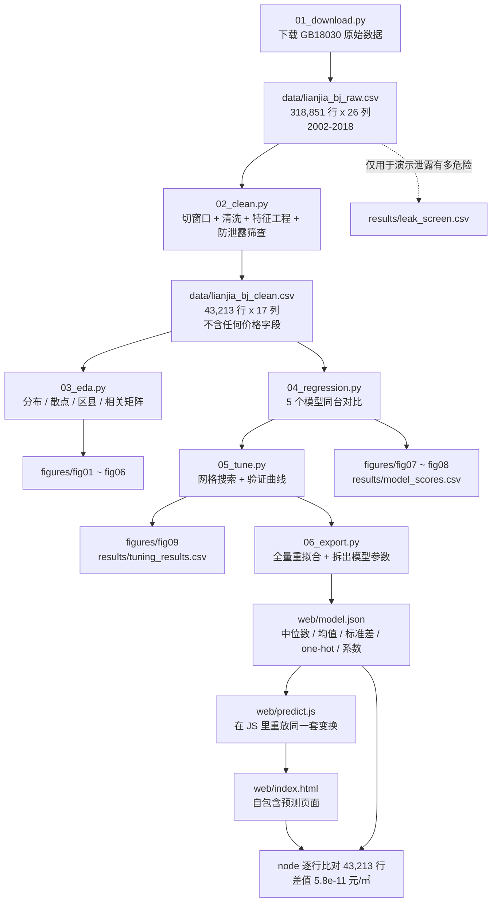

# 北京二手房单价预测

《Python机器学习教程》第 7 章「综合练习」的完整实现 —— **用真实链家二手房数据，
预测北京二手房的单价（元/㎡）**，算法全部取自教程本身：线性回归、岭回归、
多项式回归、K 近邻回归，配合交叉验证与网格搜索调参。

---

## 一、练习出处

`4-Python机器学习教程.pdf` 第 50 页，第 7 章「综合练习」全文只有一句话：

> 应用上述算法思想对股票、房价（新房、二手房）进行预测，或者根据一些个人信息
> 对要购买的物品进行推荐。

题目**没有给数据、没有指定算法、没有评分标准**。所以本项目的做法是：

1. 自己找一份可下载、可复现的真实数据（链家北京二手房成交记录 **318,851 条**）；
2. 只挑教程里讲过的回归算法（§6.1）和交叉验证调参（§2.6.5），不引入教程之外的模型；
3. 把「数据采集 → 清洗 → 探索 → 建模 → 调参 → 交付」拆成 6 个可独立运行的脚本。

**预测目标限定为「单价（元/㎡）」，不预测总价。** 这个选择本身就是本练习最有价值的
部分，理由见第四节。

---

## 二、怎么跑

环境用 `uv` 管理，Python 3.11 + scikit-learn 1.9.1。

```bash
cd D:/learnn/yingyong/ans/god
uv sync                                # 按 uv.lock 还原依赖

uv run python src/01_download.py       # 下载数据（首次运行需要联网，约 60 MB）
uv run python src/02_clean.py          # 切窗口 + 清洗 + 特征工程 + 防泄露筛查
uv run python src/03_eda.py            # 探索性分析，出 6 张图
uv run python src/04_regression.py     # 5 个模型对比，出 2 张图
uv run python src/05_tune.py           # 网格搜索调参 + 验证曲线，出 1 张图
uv run python src/06_export.py         # 生成预测网页 web/index.html 并用 node 校验
```

跑完最后一步，**双击 `web/index.html`** 就能用（不需要起服务器、不需要联网）。

六个脚本都是**幂等**的，随便重复跑。数据下载到 `data/lianjia_bj_raw.csv` 之后就会跳过，
要强制重下加 `--force`。

> `05_tune.py` 在 43,213 行上跑 KNN 网格搜索，每次预测要算十几亿次距离 ——
> 已经开了 `n_jobs=-1` 并行，仍需几分钟。其余脚本都是秒级。



---

## 三、数据

**来源**：GitHub 仓库 [`sni13/HousingPrice_Beijing`]
(https://github.com/sni13/HousingPrice_Beijing)

原始数据由第三方从**链家网北京二手房**公开页面采集，共 **318,851 条**、26 个字段，
成交时间跨 **2002–2018 年**，含经纬度、电梯、满五、梯户比、挂牌天数等。

> **⚠️ 使用声明**：该数据集由第三方采集，仓库中标注**仅供学习使用**。
> 本项目仅用于完成课程练习，不作任何商业用途，也不对数据的时效性、完整性或
> 准确性作任何担保。数据距今已有若干年，与当前市场情况无关。

### 3.1 为什么只取 2017 年

全量数据跨 2002–2018，这期间北京单价中位数从 **3.8 万**涨到 **6.6 万**。全量混在一起
建模，模型学到的很大一部分会是「**这套房是哪年卖的**」，而不是「这套房值多少」——
那不是一个估价模型。

所以 `common.py` 里有一个 `WINDOW_YEARS` 常量，默认 `(2017, 2017)`：

| 窗口 | 行数 | 说明 |
|---|---|---|
| `(2017, 2017)` | **43,217** | 本项目默认。单一日历年，年内单价中位数波动 1.17 倍 |
| `(2016, 2017)` | 134,046 | 跨两年，水位波动更大 |
| `None` | 318,851 | 全量，跨越 1.75 倍的价格水位 |

选 2017 的另一个好处是：既然是单一年份，就**不需要把「成交年月」放进特征**，
模型纯粹由房屋属性解释价格。

`02_clean.py` 的清洗规则（清洗后 **43,213** 行，剔除 4 行）：

| 规则 | 阈值 | 剔除 |
|---|---|---|
| 单价区间 | 5,000 ~ 200,000 元/㎡ | 3 |
| 面积区间 | 10 ~ 1,000 ㎡ | 1 |
| 总价缺失或非正 | — | 0 |

阈值定得很宽，只用来剔除明显是录入错误的记录（原始数据里最小单价 **136 元/㎡**）。

两个容易踩的坑，`01_download.py` 里都处理了：

| 坑 | 现象 | 处理 |
|---|---|---|
| **编码是 GB18030，不是 UTF-8** | 直接按 UTF-8 读在字节 0 就 `UnicodeDecodeError` | 下载后 `.decode('gb18030')` 再存成 UTF-8，编码问题只在 01 里出现一次 |
| **GitHub 个人仓库链接会失效** | 单靠一个 URL 早晚下不到 | `SOURCES` 列表放主/备地址，逐个重试并退避，全失败时打印手动下载指引 |

### 3.2 清洗后的建模表

`data/lianjia_bj_clean.csv`，**43,213 行 × 17 列**：

| 类型 | 字段 |
|---|---|
| 目标 | `单价`（元/㎡） |
| 数值特征 | `面积` `室` `厅` `卫` `总层数` `房龄` `梯户比` `关注人数` `电梯` `满五` `近地铁` |
| 类别特征 | `区县`(13 个取值) `楼层位置`(5) `装修`(4) `建筑类型`(3) `建筑结构`(3) |

| 指标 | 值 |
|---|---|
| 单价 最小值 / 中位数 / 均值 / 最大值 | 5,008 / **62,332** / 67,119 / 150,000 元/㎡ |
| 单价 标准差 | 24,324 元/㎡ |
| 单价 分位数 1% / 25% / 75% / 99% | 27,758 / 48,997 / 80,788 / 139,013 元/㎡ |
| 面积 最小值 / 中位数 / 最大值 | 15.0 / 72.6 / 906.0 ㎡ |
| 剩余缺失 | 房龄 793、建筑类型 478、建筑结构 80、楼层位置 4、梯户比 1 |

**缺失值一律保留 NaN，交给 Pipeline 里的 `SimpleImputer`，不手工填。**
先手工填成中位数再当无缺失数据用，是另一种失真 —— 它会让「填补」这一步
躲开交叉验证，等于让模型在训练时偷看验证集的中位数。

**异常值没有删。** 按 IQR 规则，`单价` 有相当一部分落在 `[Q1-1.5IQR, Q3+1.5IQR]`
之外。但它们不是错误值，而是核心城区与远郊的真实价差 —— 区县对单价的方差解释率
η² = **0.627**（见下节），价格跨度大**本来就是这批数据的主要信息**。按 IQR 硬删会把
最贵的核心区样本切掉，等于把模型最有效的预测依据删了。`02_clean.py` 会把这个取舍打印出来。

### 3.3 编码字段是怎么变成中文的

原始数据里 `district`、`renovationCondition`、`buildingType`、`buildingStructure`
都是**数字代码，而且没有附带码表**。本项目不猜，从数据本身实证：

- **`district`（区县）**：按代码分组算平均经纬度，与北京各区真实地理位置和真实房价
  排序对照；再用 10 个公开地标反查（金融街/国贸/中关村/天通苑/果园/亦庄/古城/良乡/
  顺义/门头沟），每个地标 2km 内最近的 60 套房源 **60/60 全部落在预期编码上**。
- **`buildingType`（建筑类型）**：code 1 总层数中位 21 层、98.0% 有电梯（塔楼）；
  code 4 总层数中位 6 层、26.6% 有电梯（多层板楼）；code 3 中位 17 层、94.6% 有电梯
  （板塔结合）。层数和电梯率各自独立地指向同一套标签。
  **注意：网上流传的「1=板楼、4=平房」与数据矛盾**（code 4 有 6 层、27% 装电梯），
  是错的。

这一组证据弱一些，按原样保留、只在注释里说明：`renovationCondition` code 4 房龄最轻
（13 年）、电梯率最高（65.3%）；code 2 单价最低。装修对单价的影响本身很小
（四档中位数 57,824 ~ 63,326，约 9%）。

---

## 四、先说结论：为什么「单价」比「总价」难得多

这一节的数字全部来自 `03_eda.py` 的实际输出，不是估算。

### 4.1 单价几乎由区县决定，而面积几乎不含信息

| 关系 | 数值 | 含义 |
|---|---|---|
| **区县对单价的方差解释率 η²** | **0.627** | 单价六成以上的波动可以由「在哪个区」解释 |
| `corr(房龄, 单价)` | **+0.328** | 越老越贵？见 4.2 |
| `corr(近地铁, 单价)` | **+0.325** | 近地铁的贵 |
| `corr(面积, 单价)` | **-0.219** | 面积越大单价越低，但关系很弱 |
| `corr(梯户比, 单价)` | -0.131 | 一梯多户的便宜 |
| `corr(室 / 厅 / 卫, 单价)` | -0.115 / -0.097 / -0.094 | 大户型单价低 |
| `corr(关注人数, 单价)` | -0.066 | 基本无关 |
| `corr(总层数, 单价)` | -0.005 | 无关 |

**面积为什么关系这么弱？** 因为目标是「每平米的价格」，面积在定义上就被除掉了。
总价 = 单价 × 面积，所以面积对**总价**当然有效（`fig02` 右图 r = **+0.688**），
但对单价效果有限（左图 r = -0.219）。这正是「预测单价」这个目标选择的全部代价 ——
也是最值得写进报告的一个发现。

### 4.2 一个辛普森悖论

`fig06` 画了两张图：

- **全部房源合并看**：`corr(房龄, 单价) = +0.328`，房子越老越贵？
- **按区县分别看**：13 条相关系数里**符号是混的** —— 从 **-0.39 到 +0.33** 都有，
  扣掉区县均值后整体只剩 **+0.064**。

真相是老房子集中在核心城区（海淀 `+0.33`、西城 `+0.13`、东城 `+0.04`），
新房子集中在近郊远郊（石景山 `-0.39`、门头沟 `-0.36`、大兴 `-0.32`、房山 `-0.27`、
昌平 `-0.14`、通州 `-0.13`），「区县」这个混杂变量把真实关系整个盖住了 ——
这就是**辛普森悖论**。

页面上的房龄图会随区县下拉框实时换线：全市虚线向上（+0.328），
换到朝阳这类区县，线基本就平了（+0.046）。

### 4.3 一个由样本量决定的结论翻转

教程 §6.1 的多项式回归在本项目上有一个值得记录的行为。**同一段代码、同一份数据源**：

| 样本量 | `Ridge+Poly2` 的 CV R² | 结论 |
|---|---|---|
| 306 行（早期版本） | **+0.005** | 多项式彻底失败，等于没学到东西 |
| 43,213 行（当前） | **+0.696** | 多项式**赢了**，而且在 5 个固定模型里排第一 |

数值列只有 11 个，平方和两两乘积把数值那一支从 11 维撑到 77 维，多出来的维度
**要靠样本量喂饱**。306 行时这 77 维是纯噪声，43,213 行时才变成真实信号。

而且 `05_tune.py` 让网格把次数和 alpha 一起搜，它选了 **degree=3**，CV R² 进一步到
**+0.702** —— 306 行时它选的是 degree=1，主动放弃了多项式。

所以「多项式会不会炸」**不是算法的固有属性，而是「模型复杂度 ÷ 样本量」的函数** ——
这正是教程 §2.4 讲的过拟合。同一个坑，样本量不够时出现，够了就消失。
同一件事还有第三个侧面：`fig09` 左图显示，43,213 行上**连 alpha 调到 0.001
都看不到 Ridge 过拟合**（见 7.2）。三个现象指向同一条规律。

---

## 五、防数据泄露（本项目最要紧的正确性问题）

### 5.1 两种泄露，两道判据各抓一个

原始数据里有这么两列，`02_clean.py` 特意把它们**留在特征集里跑一遍筛查**，
好让结果落进 `results/leak_screen.csv` —— 这是「为什么不能只看相关系数」的证据：

| 特征 | `corr(·, 单价)` | 单特征 CV R² | 谁拦住了它 |
|---|---|---|---|
| `小区均价` | **+0.932** | **+0.868** | 只有 R² 筛查拦得住 |
| `总价_万` | **+0.473** | **+0.223** | 只有列名/语义层拦得住 |

**`小区均价` —— 数值判据抓得住，名字拦不住。**
它的列名里没有「价格」二字，列名黑名单拦不住；相关系数 +0.932 用常见的 0.95
阈值也拦不住。但让它**单独预测一次目标**，R² 是 +0.868，一测就露馅。
它天然含本行信息：同小区的均价是用**包括这一套在内**的房源算出来的。

**`总价_万` —— 数值判据都抓不住，只有语义判断抓得住。**
它和目标的相关系数只有 +0.473，单特征 R² 只有 +0.223，**两道数值判据都会放它过去**。
可它是实打实的泄露：

```
总价_万 × 10000 ÷ 面积   与单价的相关 = 0.9999999998
                        最大差 27.5 元/㎡（这点差就是 CSV 里总价只存到整万元造成的舍入）
```

换句话说，**总价和面积两列一起递进去，等于把目标原样递了进去**。
把它加进特征，Ridge 的 CV R² 从 **+0.678 跳到 +0.868**，高了 19 个百分点。

之所以数值判据看不见它，是因为**线性模型自己造不出「比值」这个非线性组合**。
判据的有效性依赖于测试它用的模型类别 —— 换个能学比值的模型，这一列的 R² 立刻是 1.0。

> **所以列名/语义那一层不能省，R² 那一层也不能省。**
> 完整对照见 `figures/fig05_leak_screen.png`：那张图的柱子颜色表示「判据拦没拦住」，
> 红边表示「确实是泄露」—— 这两件事在图上正好不一致，而那个不一致就是这张图存在的理由。

### 5.2 本项目实际用的判据

`common.py` 里的 `guard_no_leakage()` 用**三道关**：

1. **列名黑名单** `LEAK_NAME_PATTERN`：任何列名匹配
   `价格|总价|单价|首付|万元|_万$|price` 一律拦截（语义层，抓 `总价_万`）；
2. **显式排除列表 `DROP_ALWAYS`**：`单价`(目标) / `totalPrice` / `communityAverage` /
   `url` / `id` / `Cid` / `tradeTime` / `DOM` / `Lng` / `Lat` / `kitchen`；
3. **单特征交叉验证筛查**（统计层，抓 `小区均价`）：把每个特征**单独**拿去预测目标，
   CV R² 超过 **0.35** 判为泄露。

阈值 0.35 的依据：`小区均价` 的 R² 是 **0.868**，必须拦；
所有合法特征里最强的 `近地铁` 只有 **0.106**、`房龄` 0.105，必须留。
0.35 落在两者之间，而且离两边都很远。

其余被排除的列及理由：

| 列 | 排除理由 |
|---|---|
| `Lng` / `Lat` | 是「区县」的更细粒度版本。放进线性模型会得到一张光滑的价格平面，区县系数变得不可读，而本练习要看懂系数 |
| `DOM`（挂牌天数） | 成交后才知道；而且「卖得慢」本身可能是价格太高的结果 |
| `kitchen` | 42,829/43,217 都是 1，零方差 |
| `tradeTime` | 只用来切窗口，不留作特征（见 3.1） |
| `url` / `id` / `Cid` | 标识符，无信息 |

另外，本项目**没有**引入任何按 `区县`/小区分组的均价类特征，也没有从 `单价`
反推的任何量 —— 那些都属于 target encoding 泄露。`02_clean.py` 落了一条断言：
建模表里不允许出现 `DROP_ALWAYS` 中的任何一列。

---

## 六、稀有类别：一个真实踩到的建模缺陷

这是本项目**唯一一个不是「算法选错」而是「数据表示有错」的问题**，值得单独一节。

one-hot + 线性模型会给每个类别一个**自由系数**，而系数是拿该类别的样本估出来的。
原始取值里：

| 类别 | 行数 | 拿到的系数 |
|---|---|---|
| `建筑类型 = 平房` | **1** | **+11,363 元/㎡** |
| `建筑结构 = 结构1` | 30 | 数万元/㎡量级 |
| `建筑结构 = 结构3` | 13 | 同上 |
| `建筑结构 = 结构5` | 37 | 同上 |

一行样本估出来的系数不是知识，是噪声。它平时藏在 `results/` 里没人看，
但**这个模型有一个网页界面** —— 页面上谁勾了「平房」，这 +11,363 元/㎡
就凭空冒出来，而且看起来和别的数字一样可信。

### 修的过程里踩的第二个坑

第一版修法是「把稀有取值并成『其他』」。**没修好。** 因为 `建筑类型` 只有
`平房` 一个稀有取值，并成「其他」之后**这个桶本身还是 1 行**，照样拿到
+10,460 元/㎡ 的系数 —— 换个名字并没有解决问题。

最终方案是**两步走**（`common.py` 的 `MIN_CATEGORY_COUNT = 200`）：

1. 稀有取值并成「其他」；
2. 并完之后**桶还不够 200 行**，就把这些行设为 NaN，交给 Pipeline 里的
   `SimpleImputer(strategy="most_frequent")` 归进最常见的那一档。

**200 这个数怎么定的**：单看均值的标准误约 `std/√n`。本数据单价标准差约 24,000，
n=200 时标准误 ≈ 1,700 元/㎡，已经和要估的效应同量级；再小就没有意义了。

这个阈值刚好把 `平房`(1)、`结构1`(30)、`结构3`(13)、`结构5`(37) 四档并掉，
而 **13 个区县里最少的门头沟有 267 行，全部保留** —— 区县是用户必须能选的维度，
不能因为样本少就并成「其他」，那样页面上就没有门头沟这个选项了。

修完之后最大的系数是 `区县 = 西城 +44,366 元/㎡`，估它的样本有 3,844 行。

---

## 七、实测结果

### 7.1 五个模型同台（`04_regression.py`）

`train_test_split(test_size=0.2, random_state=42)` → 34,570 训练 / 8,643 留出。
5 折交叉验证用 `KFold(n_splits=5, shuffle=True, random_state=42)`。

| 模型 | 5折 CV R² | CV 标准差 | 留出集 R² | 留出集 RMSE |
|---|---|---|---|---|
| 均值基线 `DummyRegressor(strategy='mean')` | -0.000 | 0.000 | -0.000 | 24,468 元/㎡ |
| 线性回归 `LinearRegression` | +0.678 | 0.006 | +0.688 | 13,669 元/㎡ |
| 岭回归 `Ridge(alpha=1)` | +0.678 | 0.006 | +0.688 | 13,669 元/㎡ |
| **岭回归+多项式 `Ridge+Poly2`** | **+0.696** | 0.005 | **+0.704** | **13,306 元/㎡** |
| K近邻回归 `KNN(k=5)` | +0.604 | 0.013 | +0.608 | 15,323 元/㎡ |

**怎么读这张表：**

- **均值基线 R² ≈ 0**，留出集 RMSE 24,468 元/㎡ 差不多就是单价标准差 24,324 ——
  印证了「什么都没学到」。这个数就是及格线：**任何模型低于它都算白做**。
- **冠军是 `Ridge+Poly2`**，CV R² = +0.696。但注意它只比不带多项式的 Ridge
  高 **1.8 个百分点**，而 CV 标准差是 0.005 —— 赢得真实，但赢得很小。
  这个结论和样本量强相关，见 4.3；`05_tune.py` 让网格搜出 degree=3 后还能再高到 0.702。
- **KNN 差 9 个百分点**，原因见 7.3。
- 线性模型和 Ridge(alpha=1) 在这份数据上**完全同分**（+0.678，RMSE 一模一样）——
  11 个数值特征全部标准化过、几十个 one-hot 列都是 0/1，本来就没什么共线性可罚，
  所以 L2 惩罚在 alpha=1 时几乎不起作用。alpha 要调到 0.18 附近才略有区别（见 7.2）。

### 7.2 调参（`05_tune.py`）

| 搜索对象 | 搜索范围 | 最优参数 | 调参前 CV R² | 调参后 CV R² | 净提升 |
|---|---|---|---|---|---|
| `Ridge.alpha` | 0.001 ~ 1000，25 组对数等分 | **alpha = 0.178** | +0.678 | +0.678 | **+0.000** |
| `Ridge` 多项式次数 + alpha | degree ∈ {1,2,3} × alpha 9 组 | **degree = 3, alpha = 3.162** | +0.678 | **+0.702** | **+0.024** |
| `KNN.n_neighbors` | {1,2,3,5,8,12,16,20,25,30,40,60} | **k = 8** | +0.604 | +0.609 | **+0.005** |

调参后的模型在留出集上：`Ridge(alpha=0.178)` → R² = +0.688、RMSE 13,669 元/㎡；
`KNN(k=8)` → R² = +0.611、RMSE 15,262 元/㎡。

**三点解读：**

1. **调参有用没用，完全看调的是哪个模型。** Ridge 的 alpha 从 0.001 搜到 1000，
   25 组候选走完，最高分和最低分**几乎没有区别**（+0.000）—— 这份数据的瓶颈不在
   超参数上。同一套代码放在 KNN 上却是 +0.005 的真实提升。这不是说教程 §2.6.5 讲的
   交叉验证调参没意义，而是说**它救不了一个本来就不合适的模型，只能让合适的模型更好一点**。
2. **多项式次数那一栏，网格自己选了 degree=3**（306 行时它选的是 degree=1），
   而且 CV R² 达到 **+0.702** —— 比 `04` 里固定 `alpha=1` 的 `Ridge+Poly2`（+0.696）
   还高一点，因为次数和 alpha 是一起搜的。同一段搜索代码、同一个 `GridSearchCV`，
   样本量变了，它的选择就跟着变了 —— 这是 4.3 那个结论的另一种说法。
3. **`fig09` 左图是本项目最值得看的一张图，因为它推翻了教科书的默认图景。**
   教程 §2.4 讲的是「alpha 小 → 过拟合，大 → 欠拟合」，但在这份数据上
   **只有右半边成立**：
   - alpha 从 0.001 到约 0.178，训练得分和验证得分**整条几乎重合**，
     最大缝隙只有 **0.0004**（训练 0.679 vs 验证 0.678）。惩罚几乎为零时
     **也不见过拟合** —— 43,213 行喂 11 个数值特征，模型复杂度远小于样本量
     能支撑的规模。
   - 唯一的边界在右边：alpha 超过约 **31.6** 才开始塌，到 1000 时验证得分掉到 **0.629**，
     那才是欠拟合 —— 惩罚大到把真实信号也压掉了。
   - 右图 KNN 则是**教科书式的过拟合**：k=1 时训练得分 **1.000**（满分，每个点最近的
     邻居就是它自己，纯背答案），验证得分只有 **0.422**，缝隙 0.578。k 增大后
     训练得分下降、验证得分上升，两条线靠拢，在 k=8 处验证得分最高 0.609。

   所以「过拟合」不是线性模型的固有病，而是**「模型复杂度 ÷ 样本量」不够小时的病**。
   这和 4.3 里 Ridge+Poly2 的结论翻转是同一件事的两面。

   > `05_tune.py` 里那张子图的副标题是**按实测缝隙算出来的**，不是写死的。
   > 一开始照抄了教科书的「alpha 太小 → 过拟合」，跑完才发现图上根本没有那道缝 ——
   > 写死的文案会让读者去找一个不存在的东西。

### 7.3 为什么 KNN 差这么多

KNN 靠「距离」找邻居，而本项目 one-hot 之后特征空间维度不低：
43,213 个样本摊在几十维的 0/1 空间里，**「邻居」这个概念的区分度就下降了**。
这是**维度灾难**，把 k 从 1 调到 60 也治不好 —— 它不是参数问题，是特征表示问题。

反观线性模型，它给每个区县学一个独立的系数，在这个场景下天然比距离度量合适。

### 7.4 为什么 R² 停在 0.70

区县解释了单价的 62.7%，模型做到 0.696。剩下的 30% 来自**数据集根本没采集的信息**：
学区、楼层高低与朝向、小区品质、楼栋在小区内的位置、临街与否、装修实际品质……
这些在真实二手房价里每一项都能差出 10%~30%。

**模型已经把数据里有的信息基本榨干了，缺的是数据，不是算法。**

---

## 八、图表

全部 9 张图在 `figures/`，中文标签，浅色底。

| 文件 | 内容 | 想说明什么 |
|---|---|---|
| `fig01_target_dist.png` | 单价分布直方图 + 取对数后 | 右偏长尾 |
| `fig02_area_vs_price.png` | 面积 vs 单价 / 面积 vs 总价 | **r = -0.219 对比 r = +0.688**，本练习的核心问题 |
| `fig03_district_price.png` | 13 个区县的单价箱线图（顺序色阶） | 区县效应 η² = 0.627；最贵的西城是最便宜的房山的 2.76 倍 |
| `fig04_corr_heatmap.png` | 相关矩阵（发散配色，灰中点对齐 0） | 含 `总价_万` 一行：与单价只有 0.47 |
| `fig05_leak_screen.png` | 单特征 CV R² 条形图 | **两根柱子的颜色与红边不一致**：判据拦住了 `小区均价`，没拦住 `总价_万` |
| `fig06_simpson_age.png` | 辛普森悖论：整体 r=+0.328 vs 分区县 r 从 -0.39 到 +0.33 | 符号在区县之间是混的 |
| `fig07_model_compare.png` | 5 个模型的 CV R² / 留出集 R² 并排条形图 | 含泄露反面教材的标注 |
| `fig08_pred_vs_actual.png` | 最优模型预测值 vs 真实值（8,643 个留出点） | 散点被压在中间，模型不敢预测极端价 |
| `fig09_validation_curve.png` | Ridge alpha 与 KNN k 的验证曲线 | 过拟合 / 欠拟合的三段走势 |

---

## 九、预测界面（`src/06_export.py` → `web/index.html`）

把模型做成一个能直接用的网页：左边填房源条件，右边立刻出预测单价，并告诉这个价钱
在 43,213 条成交记录里处于什么位置。**单个 HTML 文件，双击就开，离线可用，
不依赖任何后端。**

### 9.1 怎么让网页算出和 Python 一模一样的数

网页要显示预测值，但浏览器里没有 scikit-learn。两条路：起一个 Flask 服务让网页调
Python，或者**把模型参数搬到 JS 里**。这里选后者 —— 交付物是一个文件，不用装环境、
不用起进程、不会因为端口占用打不开。

之所以能做到**精确**而不是近似，是因为最终模型是**线性**的：
`Ridge` 的预测就是 `截距 + Σ 系数 × 特征`。所以只要把管线每一步的参数原样搬到 JS：

| Python 里的一步 | 导出的参数 | JS 里怎么重放 |
|---|---|---|
| `SimpleImputer(strategy="median")` | `impute_median` | 缺失值取训练集中位数 |
| `StandardScaler()` | `scaler_mean` / `scaler_scale` | `(v - mean) / scale` |
| `SimpleImputer(most_frequent)` | `cat_fill` | 类别缺失取众数 |
| `OneHotEncoder(handle_unknown="ignore")` | `categories` | 命中第 i 个类别则第 i 位为 1，否则全 0 |
| `Ridge(alpha)` | `coef` / `intercept` | 线性组合 |

`web/predict.js` 就是这套重放逻辑，**网页和校验脚本共用同一份实现** —— 不会各写一份
然后慢慢漂移。

### 9.2 部署的是 Ridge，不是冠军 Poly2

网页部署的是 `Ridge(alpha=0.178)`，而不是 CV 更高的 `Ridge+Poly2`：

| | CV R² | 留出集 RMSE |
|---|---|---|
| `Ridge` | +0.678 | 13,669 元/㎡ |
| `Ridge+Poly2` | +0.696 | 13,306 元/㎡ |

差距约 **0.6%**。但代价是把平方项交给用户随便填的数：二次函数在训练区间之外会
**掉头向下**，「关注人数填 500」这种输入能算出负单价。网页的输入域是开放的，
所以这一分精度不值得拿外推风险去换。

同理，网页上每个数值输入框都用 `FORM_RANGES` 卡了范围（面积 10–400 ㎡、
房龄 0–70 年、总层数 1–50、梯户比 0–2、关注人数 0–500）——
线性模型在训练数据覆盖之外属于外推，越界越不可信，宁可卡住也不给一个
看起来很精确的外推值。

### 9.3 怎么确认两边算的是同一件事

导出的参数**不做任何四舍五入**。这一点踩过坑：最初为了「让 JSON 好看点」把
`scaler` 留 6 位小数、系数留 10 位有效数字，结果 one-hot 的系数动辄上万，
这点截断误差乘上去能到 `1e-2` 元/㎡ 量级 —— `06_export.py` 里的 node 校验第一轮
就是这么把问题抓出来的。现在一律按 `float64` 原样导出，`json.dumps` 输出的 repr
本身就是能精确往返的最短表示。

校验分两道，都会 `assert`，失败就拒绝发布：

```
校验网页：
  页面脚本 2 个块全部通过语法检查  ✓
  JS 与 Python 逐行比对 43,213 行：最大差值 5.821e-11 元/㎡（相对 5.8e-16）  ✓ 一致
```

**第一道：页面脚本的语法检查。** 用 node 的 `vm.Script` 把 `index.html` 里的内联
脚本编译一遍。这一道是**踩坑之后补上的**：模板里曾经多写了一个 `}`，
结果页面打开是一张空表（标题、下拉框、数字全空），而第二道校验打印的却是 ✓ ——
因为第二道验的是 `predict.js` 里的**预测函数**，它和页面脚本是两份代码。
语法错误不需要 DOM 就能发现，所以这道检查很便宜。

**第二道：预测函数的逐行比对。** 用 `predict.js` 把 **43,213 行数据整表跑一遍**，
和 Python 的预测值逐行比对，差值超过 `1e-6` 元/㎡ 就报错。

`5.8e-11` 已经贴着 `float64` 的精度极限（相对误差 `5.8e-16`，约 2 个 ULP），
而网页把价格显示到整数位，所以这点差别连显示的最后一位都影响不到。
比较用的期望值也必须是未取整的 —— 若这里写 `round(..., 6)`，光期望值自己就带了
`5e-7` 的误差，会把真正的差异淹没。

> 没装 node 时这两道都会打印 `[跳过]` 并继续，但会明确提示「网页逻辑未经验证」。

### 9.4 页面上有什么

- **预测结果**：大字单价值 + 房源摘要（`朝阳 · 89㎡ · 2室1厅1卫 · 15 年房龄 · 精装`）。
- **两个对照**：全市中位数与该区县中位数，各带一个涨跌百分比，用来看「这个价钱是贵还是便宜」。
- **误差如实标注**：RMSE 13,669 元/㎡ 直接写在页头，并说明「这个数字是一万多元量级的
  估计，不是精确报价」。
- **16 个输入项**：区县、面积、房间数、厅数、卫生间数、楼栋总层数、梯户比、挂牌关注人数、
  楼层位置、装修、建筑类型、建筑结构，外加电梯/满五/近地铁三个开关。
  房间数/厅数/卫生间数都是**下拉框**，取值从数据里读出来。
- **三张图**，全部随输入实时重画：
  1. **单价分布** —— 全市 43,213 套与该区县房源各按自己的总量折算成百分比后并排，
     橙色竖线是预测，虚线是全市中位数，并标出「高于该区县百分之多少的房源」；
  2. **面积 vs 单价** —— 抽样 1,476 个点（按区县分层），蓝线是**全部 43,213 套**
     按面积十分位的中位数；
  3. **房龄 vs 单价** —— 全市趋势虚线 `r = +0.328` 与该区县趋势实线画在同一张图上，
     是 §4.2 辛普森悖论的直观版。

**数据量：能精确的都在 Python 侧算准，只有散点才抽样。**

| 内容 | 用了多少行 |
|---|---|
| 直方图（全市 + 每个区县各一条） | **全部 43,213 行**，一个点都不抽 |
| 分箱中位数线 | **全部 43,213 行**按十分位分箱 |
| 拟合线 / r 值 / 区县中位数 | **全部 43,213 行** |
| 散点 | 抽样 1,476 行，按区县分层，页面上标明「抽样」 |

43,213 行不可能整表塞进网页（散点图就是四万个 SVG 圆点）。但直方图、分位数、
中位数这些统计量本身很小 —— 33 个箱 × 14 条 = 462 个整数，携带的信息量
和整表一样，所以全部用真值。

几个刻意的取舍：

- **直方图两条分布各自折算成百分比**。不这么做的话，全市四万多条对区县几百条，
  两个量级画在同一个计数轴上，区县那一条直接看不见。
- **趋势线在 Python 侧算好再导出**（`area_trend` / `age_trend` / `age_trend_by_district`），
  网页只负责画。这样网页上的 `r` 值和 README 里 `fig02`/`fig06` 的数字必然一致。
- **横轴截至 99% 分位**，轴标签里写明这件事。面积最大 906 ㎡，按最大值铺满会把
  99% 的房源压成左边一条竖线。房龄同理。
- **分箱线的横坐标用箱内中位面积**，不是箱边界中点。最右一箱是 `(114, 906]`，
  中点 510 落在几乎没有房源的地方，而该箱实际中位面积只有约 170 ——
  用中点画线等于把这条线甩到空处。
- **`|r| < 0.05` 时不写方向**，显示「基本无关」。朝阳的房龄 `r = +0.046`，
  照字面写成「越老越贵」是过度解读 —— 0.046 解释的方差是 0.2%。
- **配色和字号跟着系统深色模式切换**。SVG 元素全靠 CSS class 上色，
  主题切换时不需要重画，只换 CSS 变量。
- **`web/index.html` 是生成物**，改编模板 `web/template.html` 或 `predict.js` 之后
  要重跑 `06_export.py`。它仍进版本库，是为了让仓库 clone 下来就能直接用。

---

## 十、教程 API → 现代 scikit-learn 对应表

教程写作时间较早，其中不少 API 已经被移除或改名。本项目统一用现代 API：

| 教程里的写法 | 现状 | 本项目改用 |
|---|---|---|
| `sklearn.grid_search.GridSearchCV` | 已移除 | `sklearn.model_selection.GridSearchCV` |
| `sklearn.cross_validation.train_test_split` | 已移除 | `sklearn.model_selection.train_test_split` |
| `sklearn.cross_validation.cross_val_score` | 已移除 | `sklearn.model_selection.cross_val_score` |
| `sklearn.cross_validation.KFold` | 已移除 | `sklearn.model_selection.KFold` |
| `sklearn.datasets.samples_generator.make_blobs` | 已移除 | `sklearn.datasets.make_blobs` |
| `sklearn.preprocessing.Imputer` | 已移除 | `sklearn.impute.SimpleImputer` |
| `LinearRegression(normalize=True)` | 参数已删除 | 标准化交给 Pipeline 里的 `StandardScaler` |
| `OneHotEncoder(sparse=False)` | 参数已改名 | `OneHotEncoder(sparse_output=False)` |
| `KFold(n_splits=5)`（不打乱） | 仍可用但不推荐 | `KFold(..., shuffle=True, random_state=42)` |
| `make_pipeline(('name', est), ...)` | **1.9 起不再接受 `(名字, 估计器)` 元组** | 用 `Pipeline([('name', est), ...])` |

最后一行是本项目实际踩到的坑：`make_pipeline` 会把整个 `('imp', SimpleImputer(...))`
元组当成一个「估计器」，名字取类型名，于是 step 变成
`('tuple-1', ('imp', SimpleImputer(...)))` 这种废东西，`ColumnTransformer`
接着报 `All estimators should implement fit and transform`。
**要自定义 step 名字，只能用 `Pipeline` + 显式列表。** 详见 `common.py` 的注释。

另外两处 pandas 的坑，注释也写在 `common.py` 里：

- **pandas 3 起字符串列的 dtype 是 `str` 而不再是 `object`**。写
  `if df[c].dtype == object` 会**静默跳过所有字符串列**，`.strip()` 完全失效。
  本数据的字符串列带填充空格（`' 精装 '`），不 strip 会让 OneHotEncoder
  把 `' 精装 '` 和 `'精装'` 当成两个类别。
- **`groupby(...).apply(...)` 在 pandas 3 里需要 `include_groups=False`**，
  否则分组列会同时出现在参数和结果里，触发警告甚至报错。

---

## 十一、局限与未覆盖的部分

**方法论上的局限（诚实交代）：**

1. **交叉验证有乐观偏差**。同一个小区可能有多套房，普通 `KFold` 会把它们分到
   训练集和验证集两侧，等于让模型「见过类似样本」。严格的画法是
   `GroupKFold(groups=小区)`。原始数据里没有小区标识列（只有经纬度，而经纬度
   被主动排除了），所以先用普通 KFold，但**这个偏差是存在的，0.696 偏乐观**。
2. **没有独立测试集做最终验证**。留出集同时承担了「调参后验一次」的角色，
   严格来说它已经被看过了。
3. **部署的模型和报告的指标不是同一个对象**。`06_export.py` 里的模型是在
   **全部 43,213 行**上重新拟合的；README 里的 0.678 / 0.696 描述的是泛化能力，
   在训练集上评估。真正拿去用的模型没理由只用 80% 的数据，但这也意味着
   页面上给不出一个无偏的误差估计 —— 页头显示的 RMSE 来自留出集。
4. **数据是成交价**，但采集时间距今已有若干年，与当前市场无关。

**刻意没做的部分（用户已明确选择只做回归 + 交叉验证调参）：**

- 聚类（KMeans、模糊 C 均值）、PCA 降维
- 分类算法（KNN 分类、决策树、朴素贝叶斯、SVM、神经网络）
- 这些章节与本题（预测连续价格）无关，故未纳入。

**如果想继续改进，按性价比排序：**

1. 补数据 —— 学区、楼层、朝向、房本年限，比换模型有用得多；
2. 用 `GroupKFold(groups=小区)` 得到无偏的估计（需要补采小区标识）；
3. 年份窗口再收窄到季度级别，或用时间序列交叉验证，让评估更贴近「预测未来」。

---

## 十二、文件清单

```
god/
├── pyproject.toml / uv.lock        依赖声明与锁定
├── README.md                        本文件
├── data/
│   ├── lianjia_bj_raw.csv           01 产出：GB18030 → UTF-8，318,851×26（59 MB，未进版本库）
│   └── lianjia_bj_clean.csv         02 产出：建模表，43,213×17，不含任何价格字段
├── src/
│   ├── common.py                    公共模块：路径、窗口、特征工程、防泄露校验、绘图样式
│   ├── 01_download.py               数据采集                     §3.1
│   ├── 02_clean.py                  切窗口 + 清洗 + 特征工程 + 泄露筛查  §3.2 / §3.3
│   ├── 03_eda.py                    探索性分析，出 6 张图
│   ├── 04_regression.py             回归模型对比 + 基线            §6.1
│   ├── 05_tune.py                   交叉验证调参 + 验证曲线        §2.6.5 / §2.4
│   └── 06_export.py                 导出模型参数 + 渲染网页 + node 双重校验
├── web/
│   ├── template.html                页面模板（未内联模型数据）
│   ├── predict.js                   JS 版预测函数，网页与校验脚本共用
│   ├── model.json                   06 产出：模型参数，也是 node 校验的输入
│   └── index.html                   06 产出：自包含页面，双击即用
├── figures/                         fig01 ~ fig09，9 张 PNG
└── results/
    ├── leak_screen.csv              单特征泄露筛查结果
    ├── model_scores.csv             5 个模型的 CV / 留出集指标
    ├── tuning_results.csv           网格搜索结果
    ├── dropped_rows.csv             被清洗规则剔除的 4 行（全部，便于复核）
    └── app_test_cases.csv           前 12 行房源的 Python 预测值，供手工核对网页
```

`common.py` 是**唯一**定义「哪些列绝对不能进模型」和「取哪一年的数据」的地方。
这种规则不能有两份定义 —— 早晚会有一份先过期。
