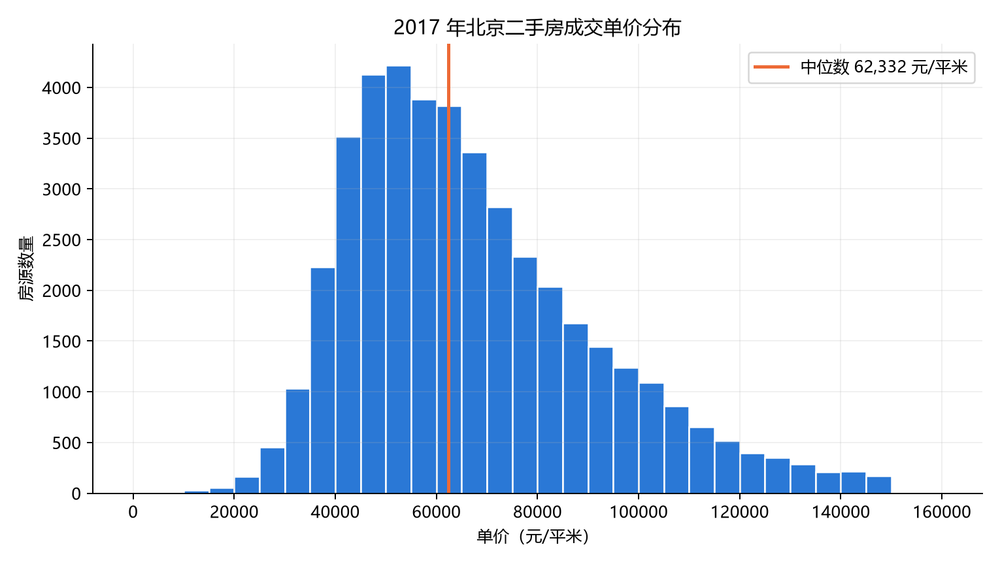
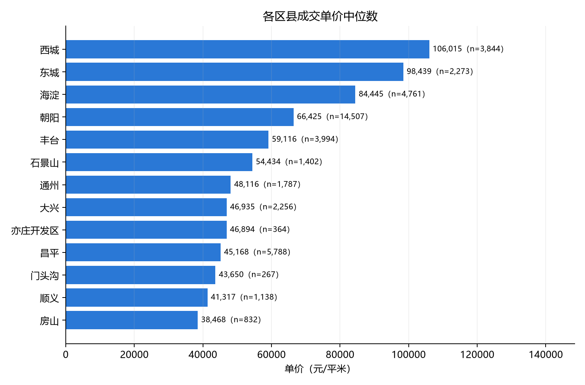
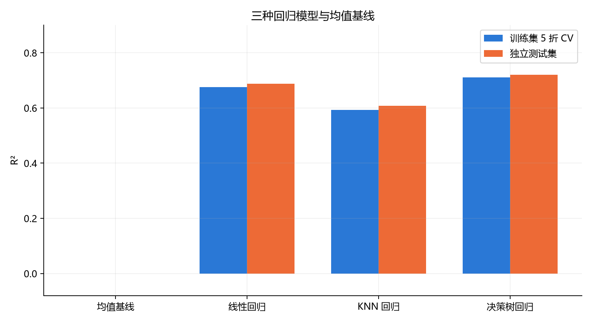
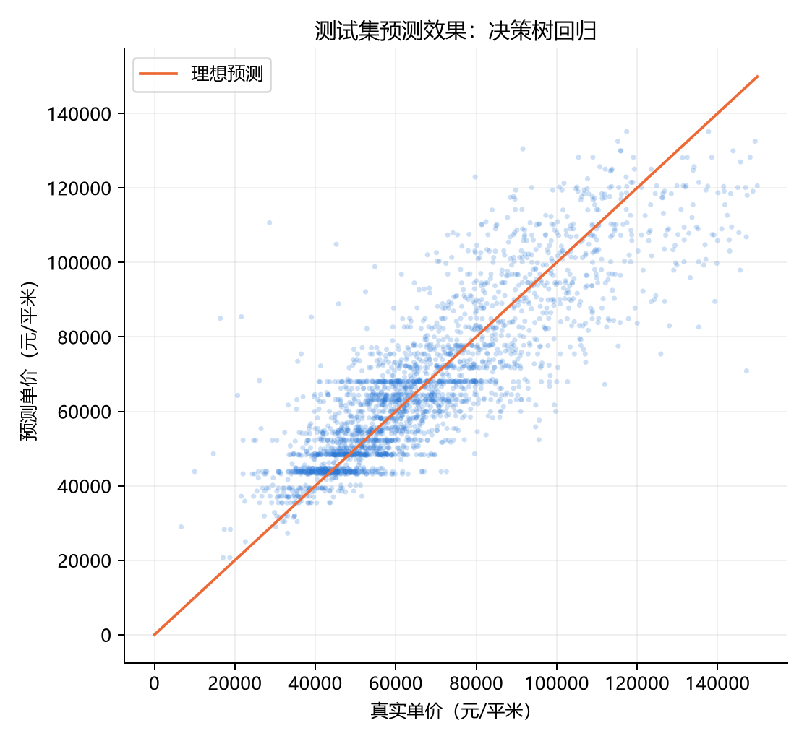

# 综合实验报告：2017 年北京二手房单价预测

## 1. 实验目标

《应用综合实验》要求在 1 万条以上的数据上比较至少三种机器学习模型，并对过程和结果做量化分析。本实验预测北京二手房的**成交单价（元/㎡）**。单价是连续数值，因此选择回归方法。

## 2. 数据与处理

数据来自第三方整理的链家北京二手房成交记录。原始文件约 31.9 万条、26 列，时间跨多个年份。为减少不同时期市场价格变化的干扰，本实验只取 **2017 年**的 43,217 条记录；剔除单价、面积或总价明显错误的 4 条后，建模表有 **43,213 条**。

使用 16 项房屋属性，包括面积、室厅卫、楼层、房龄、区县、装修及设施等。**总价、小区均价、成交时间和房源标识符不作为特征**：前两者与目标价格直接相关，可能造成数据泄露。缺失值填补、数值标准化和类别编码均放入模型管线，在每个训练折内重新学习，避免验证折的信息进入预处理。

图 1 展示单价分布，图 2 展示不同区县的单价中位数。区县间价差明显，因此保留区县作为类别特征。

## 3. 模型与实验设计

三种模型分别代表不同的预测思路：

| 模型 | 作用与设置 |
|---|---|
| 线性回归 | 学习特征与单价之间的线性关系，作为简单、可解释的模型。 |
| KNN 回归 | 使用最接近的 5 条训练记录预测，检验相似房源的价格是否有参考价值。 |
| 决策树回归 | 按属性逐层划分房源；最大深度 12、叶节点至少 20 条记录，以限制过拟合。 |

另外使用“始终预测训练集均值”的模型作为参考基线，**不计入三种机器学习模型**。三种模型使用相同的 16 项特征、相同的数据划分和相同的评价方法。

按固定随机种子 42 划分 **34,570 条训练记录**和 **8,643 条测试记录**。先在训练集上进行打乱后的 5 折交叉验证，比较 R²；再在测试集上计算 R²、MAE、RMSE。MAE 与 RMSE 的单位均为元/㎡，越小越好。

## 4. 实验结果

| 模型 | 5 折 CV R² | 测试集 R² | 测试集 MAE | 测试集 RMSE |
|---|---:|---:|---:|---:|
| 均值基线 | -0.000 | -0.000 | 19,499 | 24,468 |
| 线性回归 | 0.676 | 0.688 | 10,253 | 13,669 |
| KNN 回归 | 0.593 | 0.608 | 11,055 | 15,323 |
| **决策树回归** | **0.711** | **0.720** | **9,462** | **12,949** |

原始精度和折间标准差见 [结果表](results/model_scores.csv)。决策树按训练集交叉验证选出，在测试集上也取得最高 R²。相比线性回归，它的测试集 R² 高约 **0.032**，MAE 低约 **791 元/㎡**。这说明房屋属性与单价之间存在单一线性关系难以表达的差异。KNN 在当前特征表示下表现最弱；其训练集 R² 为 0.741，交叉验证 R² 为 0.593，说明只看训练集拟合程度会高估它的效果。

## 5. 结论与局限

本次比较中，决策树回归最适合这份数据，但测试集 MAE 仍接近 **9,500 元/㎡**，预测误差不能忽略。项目使用的是 **2017 年历史成交数据**，不代表当前北京市场。原数据缺少可靠的小区分组标识；随机划分可能把相近房源分到训练和测试两侧，因此分数可能高估模型对全新小区的表现。

本实验的可复现脚本为 `src/01_download.py`、`src/02_clean.py`、`src/03_eda.py` 和 `src/04_regression.py`。课堂展示可直接打开 [静态汇报页](web/index.html)。
